<p align="center">
  
</p>

<div align="center">

[](https://pypi.org/project/openscenegraph/)
[](https://www.python.org/)
[](https://github.com/AlphaPixel/OpenSceneGraph.py/actions/workflows/wheels.yml)
[](LICENSE)
[](https://en.cppreference.com/w/cpp/20)
[](https://github.com/openscenegraph/OpenSceneGraph)

</div>

# Key Features (September, 2026)

- Covers most of the core `osg` namespace, as well as the immediately useful
  portions of `osgViewer`, `osgUtil`, `osgGA`, and `osgDB`. Any missing or
  unwrapped objects can be added quickly as needed.

- Implements only the modern, non-FFP parts of OpenSceneGraph; all testing is
  done with GL3/GLCORE as the minimum target.

- Works in both modular *and* embedded setups. In an embedded build, the entire
  `OpenSceneGraph.py` module interface can be **compiled into** the resulting
  library or binary, making packaging and deployment much simpler.

- Provides solutions to some of the sharp edges involved in wrapping
  intrusively reference-counted code, especially *object lifetime*. In many
  `pybind11` bindings, wrapper code must rely heavily on `keep_alive<>` in
  order to guarantee object lifetime, which can lead to memory bloat and object
  accumulation throughout the life of the process. `OpenSceneGraph.py` uses a
  different approach in which the owning `PyObject*` reference is **stored
  inside the `UserDataContainer`** of the instance, so when something is
  deleted or reassigned, it can truly be deallocated.

- Preserves **stable Python identity** for C++ object instances, even when
  those objects are accessed repeatedly through container proxies or property
  getters. This avoids one of the most common and confusing failure modes in
  C++/Python bindings: multiple Python wrapper objects referring to the same
  underlying C++ instance without behaving like the "same object" at the Python
  level.

- Uses a **unified proxy architecture** across intrusive reference-counted
  objects, shared-ownership objects, sequence-style containers, mapping-style
  containers, and persistent property-backed references. This keeps the Python
  API consistent while still respecting native ownership and lifetime rules.

- Overhauls the OSG interface, making it naturally Pythonic and substantially
  more pleasant to work with. Instead of binding the OSG API 1:1,
  `OpenSceneGraph.py` exposes semantic proxies over things like `osg::Group`,
  `osg::Geode`, `osg::Geometry`, and more. For example:

  ```py
  # Instead of this...
  g = osg.Group()
  g.addChild(osg.Node())
  g.addChild(osg.Node())
  g.addChild(osg.Node())

  # ...you instead do something like:
  g = osg.Group(name="Group", children=(
      osg.Geode(name="Geode_00"),
      osg.Node(name="Node_00", debug=True),
      osg.Node(),
      # ...etc...
  ))

  g.children[0].drawables.extend((
      osg.Geometry(),
      osg.ShapeDrawable(),
      # ...etc...
  ))
  ```

> [!NOTE]
> Wherever it is practical to improve the ergonomics of the aging OSG API in
> Python, we do. Most attributes can be set both at construction time and
> through traditional setter-based APIs. Likewise, anything that functions as
> a callback in OSG can usually be supplied either through the traditional
> method-override approach or by simply passing any suitable Python
> callable.

- Container-like APIs are backed by semantic proxies, not thin wrappers. These
  preserve object identity, native behavior, and ownership rules while
  supporting natural Python idioms such as indexing, iteration, mutation,
  appending, extending, and keyword-based construction.

- Provides a robust callback binding system supporting both Python subclass
  overrides and plain Python callables/lambdas for OSG callback types.
  Traversal semantics are preserved correctly, so native OSG behavior is not
  replaced by a Python-specific approximation.

- Object instances pass cleanly across the Python/C++ boundary; anything created
  in one environment can be accessed directly and used in the other.

- Designed for incremental embedding into existing C++ OSG applications. Python
  can be introduced as a scripting/runtime layer without requiring an all-Python
  rewrite of the existing codebase.

- All of the OpenSceneGraph.py headers are exposed, allowing any existing
  codebase to adapt its current stack so that it works inside OpenSceneGraph.py
  natively. Helpers, trampoline classes, proxy machinery, and related
  infrastructure are all accessible from C++.

- Makes wide use of the buffer protocol, meaning data coming from libraries like
  NumPy or PyTorch can be passed to and visualized with OpenSceneGraph.py with
  almost no copying of data. This also works in reverse: data from
  OpenSceneGraph.py can be sent to NumPy, PyTorch, and similar libraries with
  little to no copying.

- Supports modern interactive and asynchronous workflows, including cooperative
  asyncio integration, background task execution, progress/event queues, and
  clean cross-language cancellation and shutdown patterns.

- Perhaps best of all: OpenSceneGraph.py can be used INTERACTIVELY. You can fire
  up something like ipython, interactively add objects to your scene, modify
  attributes, change object internals, and watch it all take effect
  immediately--including the entire Program / Shader pipeline.

# Examples

The best way to get acquainted with `OpenSceneGraph.py` is to dive right into
the [examples](examples).

## CUDA (AI/LLM Integration)

Python is the default language of the AI/ML world, and `OpenSceneGraph.py`
doesn't stop at making OSG easy to script from Python; it can also
visualize data that never leaves the GPU in the first place.
[`pyosg-cuda-points.py`](examples/pyosg-cuda-points.py) proves the core
mechanism: a CUDA kernel (compiled at runtime via NVRTC--no system CUDA
toolkit required) writes directly into the same GL buffer OSG renders from,
every frame, with zero CPU involvement in the actual payload. The only thing
that ever touches the CPU is a single scalar (time), exactly like a GLSL
uniform. Swap the kernel body for "read from an LLM's hidden-state tensor"
and nothing about the architecture changes; this is the seed of a much
bigger idea: visualizing GPU-resident model internals (embeddings,
attention, diffusion latents) live, with a provable "no copies" story.

[`pyosg-points.py`](examples/pyosg-points.py) is the simpler sibling for
when you don't mind the CPU being involved: it feeds NumPy-simulated ML
output (positions and labels, as if a PyTorch inference result had already
been moved to host memory) into OSG through the buffer-protocol bindings --
still close to zero-copy for Python<->OSG, just not zero-copy all the way
from the GPU.

> [!NOTE]
> **WIP:** a live LoRA training visualizer--watching a real adapter's
> weights evolve, GPU-resident, while actual training happens--is in
> progress. Feasibility is confirmed (verified end-to-end on a modest GPU,
> no huge rig required); the example itself isn't written yet.

## RTT/MRT/TAA

Render-to-texture, multiple render targets, and temporal techniques are
first-class citizens in `OpenSceneGraph.py`, not something bolted on --
and wiring up a multi-camera pipeline in Python is noticeably less ceremony
than the equivalent C++.

- [`pyosg-rtt.py`](examples/pyosg-rtt.py) - the basics: a `PRE_RENDER`
  camera renders color and depth to textures, and a fullscreen `POST_RENDER`
  pass composites them (toon shading plus a depth-based outline).
- [`pyosg-blur.py`](examples/pyosg-blur.py) - chained multi-pass: several
  single-output passes feeding into each other, forming a Gaussian blur
  pipeline.
- [`pyosg-mrt.py`](examples/pyosg-mrt.py) - true MRT: one geometry pass
  writing color *and* normal buffers simultaneously via GLSL
  `layout(location = n) out`, the shape a deferred G-buffer actually needs.
  Press 1/2/3 to inspect the individual G-buffer channels.
- [`pyosg-taa.py`](examples/pyosg-taa.py) - temporal anti-aliasing:
  sub-pixel camera jitter accumulated into a history texture across frames,
  converging a still view to a visibly smoother image over 16 frames.

## Polyhaven API

[`pyosg-polyhaven-texture.py`](examples/pyosg-polyhaven-texture.py) pulls a
full PBR material (base color, normal, ORM) straight from
[Polyhaven](https://polyhaven.com)'s free asset library--by slug, by URL,
or from a local glTF--and renders it with the same physically based
lighting model as the Lighting Series. Massive thanks to Polyhaven for
making such high-quality, freely licensed assets available to the whole
community; examples like this one wouldn't be nearly as compelling without
them.

## Async

`OpenSceneGraph.py` deliberately leans on Python's `asyncio` rather than
threading wherever background work is needed. Interacting correctly with
the GIL from multiple native threads is notoriously easy to get subtly
wrong, while `async`/`await` keeps everything on one thread and one event
loop.

- [`pyosg-async.py`](examples/pyosg-async.py) - the core pattern:
  background work reports progress back to the render loop through a
  `call_soon_threadsafe` queue bridge, while `viewer.frame()` keeps pumping
  the whole time.
- [`pyosg-async-gltf.py`](examples/pyosg-async-gltf.py) - the same pattern
  applied to real asset loading: the viewer window appears immediately and
  the model pops in a few seconds later, with real per-stage
  (parsing/textures/nodes) progress, all off the GIL via
  `asyncio.to_thread`.

## Lighting Series

In preparation for release, we built a 12-part lighting series that walks
from a bare Lambert diffuse term all the way up to a full deferred PBR + IBL
pipeline with a Sketchfab-parity post-processing chain. Each step is a
complete, runnable example in [`examples/pyosg-lighting`](examples/pyosg-lighting)
that builds directly on the one before it.

> [!NOTE]
> You will need our [osgx](https://github.com/cubicool/osgx)
> to load GLTF 2.0 models. It is included as a submodule (see
> [Building](#Building) for more information).

<table>
<tr>
<th align="center">Preview</th>
<th>Description</th>
</tr>

<tr>
<td align="center">

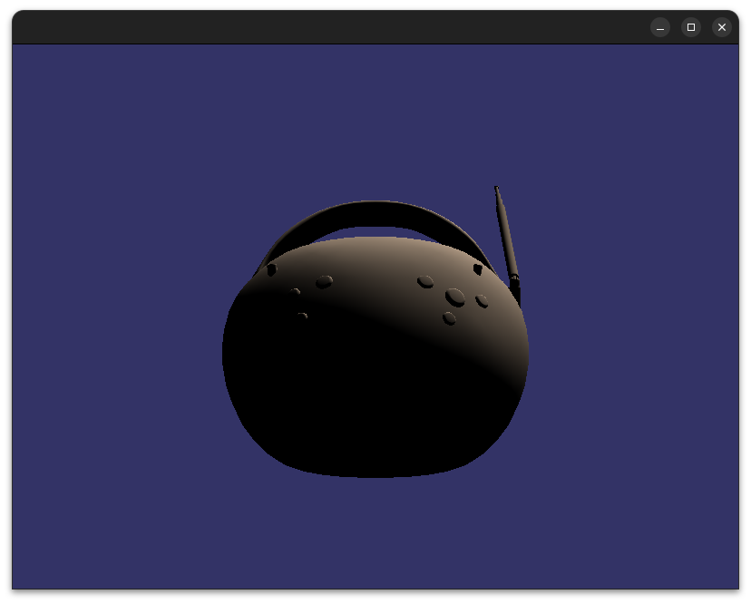

</td>
<td>

**00 - Lambert Diffuse** &middot; [`00-lambert.py`](examples/pyosg-lighting/00-lambert.py)

The simplest physically-motivated lighting model: brightness depends only on
the angle between the surface normal and the light direction. There is
intentionally no ambient term, so the dark side goes pure black; the
baseline every later step improves on.

</td>
</tr>

<tr>
<td align="center">

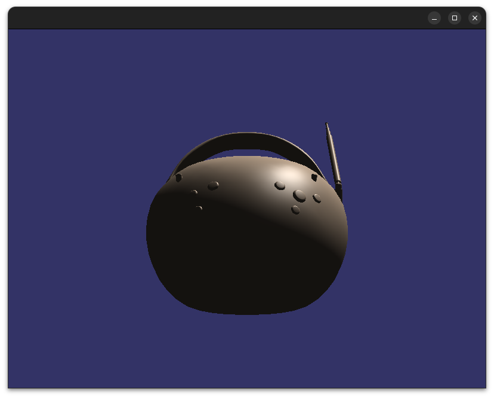

</td>
<td>

**01 - Blinn-Phong** &middot; [`01-blinnphong.py`](examples/pyosg-lighting/01-blinnphong.py)

Three additions on top of Lambert: a constant ambient lift so the dark side
is never pitch-black, specular highlights via the halfway vector `H =
normalize(L + V)`, and eye-space position passed from the vertex to the
fragment shader so `V` can be computed per-fragment.

</td>
</tr>

<tr>
<td align="center">

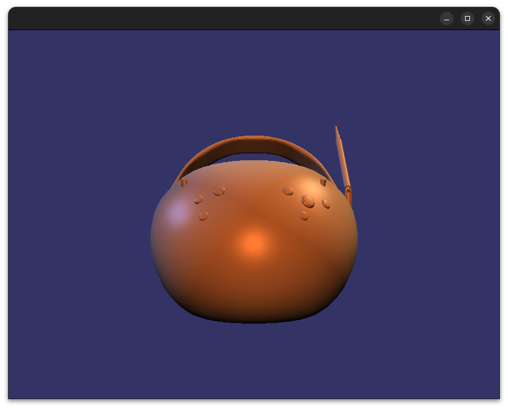

</td>
<td>

**02 - Multiple Point Lights** &middot; [`02-multilights.py`](examples/pyosg-lighting/02-multilights.py)

Directional lighting gives way to positional point lights with real
inverse-square attenuation, arranged in a classic three-point cinematography
setup (key, fill, rim).

</td>
</tr>

<tr>
<td align="center">

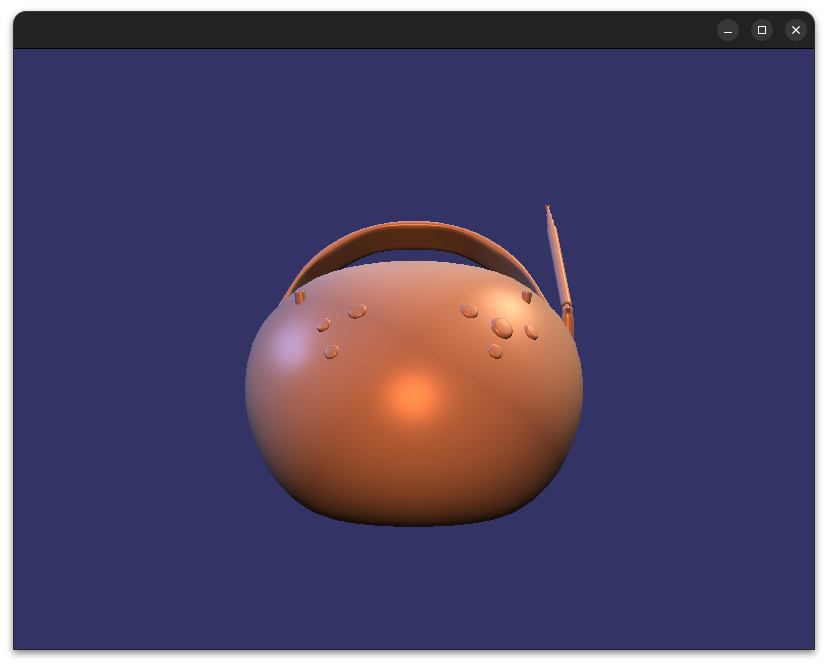

</td>
<td>

**03 - Hemispherical Ambient** &middot; [`03-hemiambient.py`](examples/pyosg-lighting/03-hemiambient.py)

The flat ambient constant is replaced with a two-color hemispherical ambient
term, lerped by `dot(N, worldUp)`. One extra dot product, no textures, and
shadowed surfaces immediately read as sitting in an environment instead of a
void.

</td>
</tr>

<tr>
<td align="center">


</td>
<td>

**04 - Base Color Texture** &middot; [`04-basecolor.py`](examples/pyosg-lighting/04-basecolor.py)

The flat `albedo` uniform is swapped for the model's actual glTF base color
texture, sampled with UVs carried through from `osg_MultiTexCoord0`.

</td>
</tr>

<tr>
<td align="center">

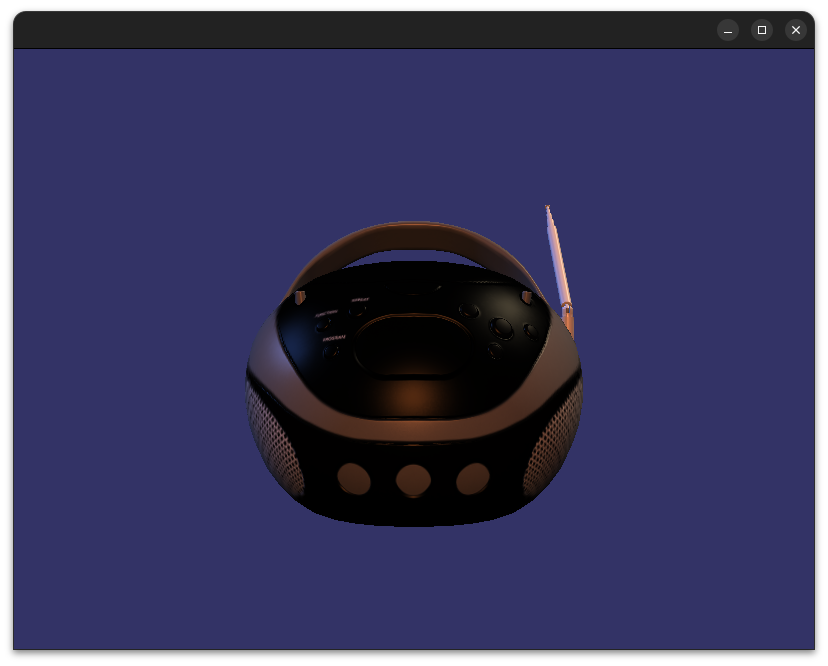

</td>
<td>

**05 - Normal Mapping** &middot; [`05-normalmapping.py`](examples/pyosg-lighting/05-normalmapping.py)

The smooth per-vertex geometric normal is replaced with a per-texel normal
sampled from a tangent-space normal map, reconstructed in eye space via a
TBN matrix built from glTF's `VEC4` tangent attribute.

</td>
</tr>

<tr>
<td align="center">

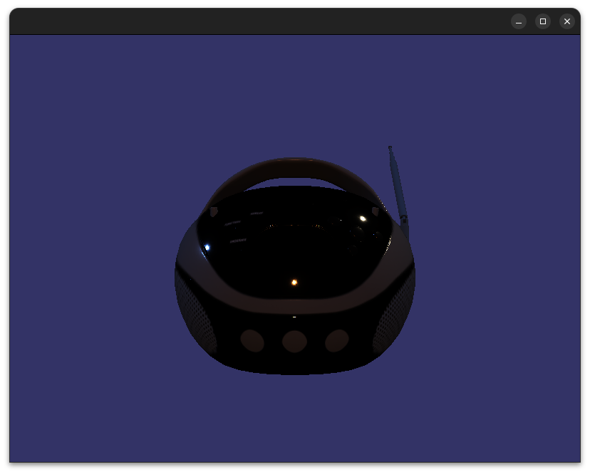

</td>
<td>

**06 - Physically Based Rendering** &middot; [`06-pbr.py`](examples/pyosg-lighting/06-pbr.py)

Blinn-Phong is replaced with the Cook-Torrance BRDF and a full
metallic/roughness workflow driven by the ORM texture: GGX normal
distribution, Smith geometry masking, and Fresnel-Schlick, combined per the
metallic/dielectric split.

</td>
</tr>

<tr>
<td align="center">

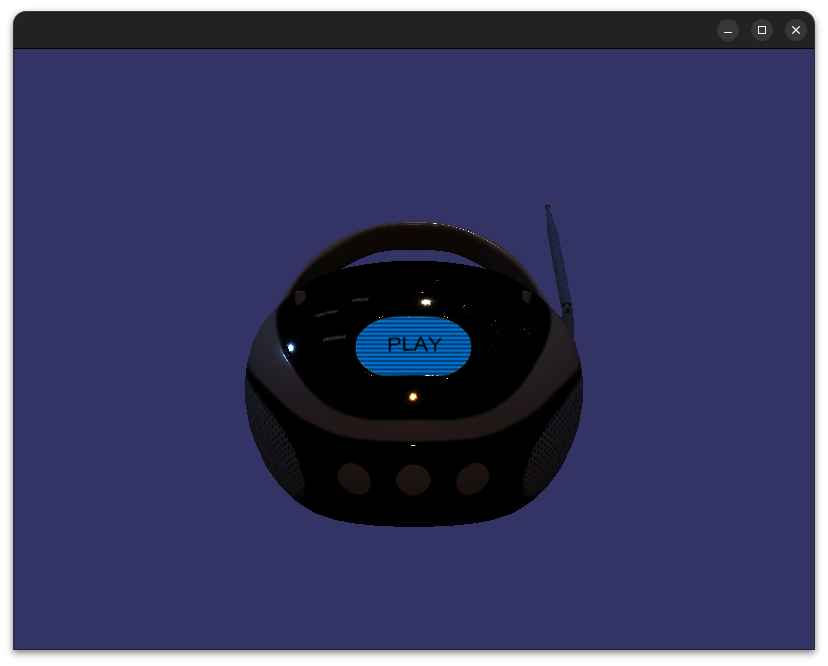

</td>
<td>

**07 - Emissive** &middot; [`07-emissive.py`](examples/pyosg-lighting/07-emissive.py)

The simplest step in the series: one texture sample, added unconditionally
*after* all lighting, unmultiplied by any light contribution; for surfaces
that generate their own light, like LEDs or hot metal.

</td>
</tr>

<tr>
<td align="center">

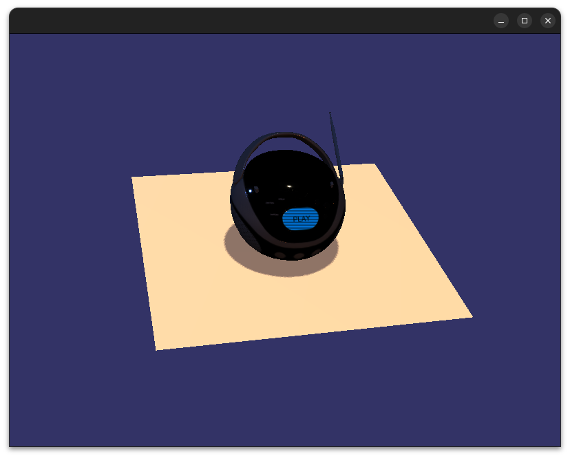

</td>
<td>

**08 - Shadow Mapping** &middot; [`08-shadows.py`](examples/pyosg-lighting/08-shadows.py)

A `PRE_RENDER` shadow camera renders the scene from the key light's point of
view into a depth texture; the main pass transforms each fragment into
light-clip space and compares against it. Identical lights and shader math
to step 07; only `shadowFactor()` is new.

</td>
</tr>

<tr>
<td align="center">

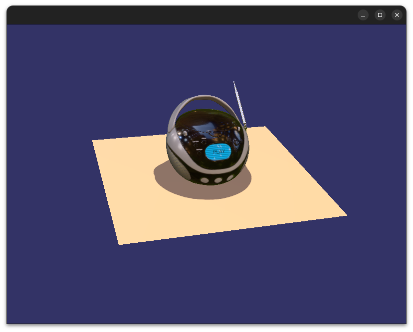

</td>
<td>

**09 - Image-Based Lighting** &middot; [`09-ibl.py`](examples/pyosg-lighting/09-ibl.py)

Adds image-based lighting from a pre-baked GGX-prefiltered cubemap (loaded
via the `osgdb_ktx2` plugin), a startup-baked BRDF LUT, and asynchronously
computed spherical-harmonics diffuse irradiance from an HDR environment.

</td>
</tr>

<tr>
<td align="center">

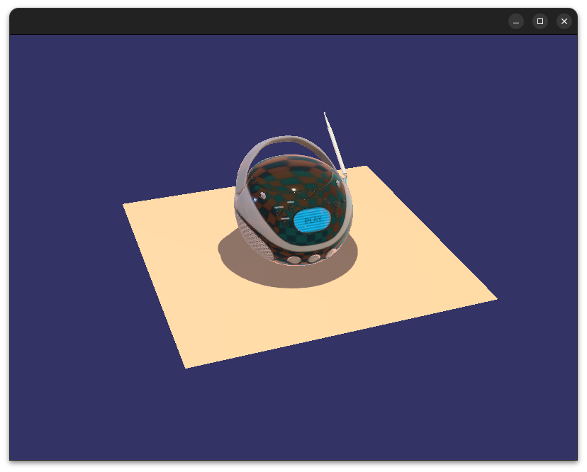

</td>
<td>

**10 - Dynamic IBL Probes** &middot; [`10-dynamicprobes.py`](examples/pyosg-lighting/10-dynamicprobes.py)

Instead of loading a static `.ktx2` once, the specular environment cubemap
is baked *live* on the GPU using `osgx`'s C++ prefilter pipeline exposed
to Python. Press `r` to repaint the entire environment and watch the
reflection rebake in real time.

</td>
</tr>

<tr>
<td align="center">

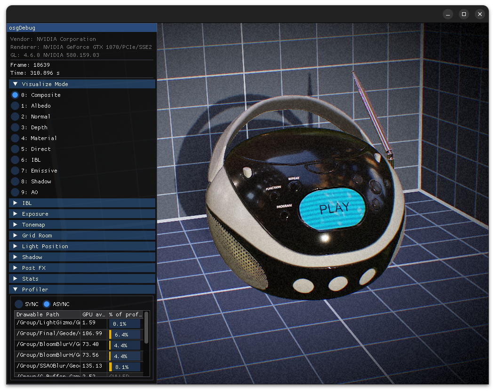

</td>
<td>

**11 - Sketchfab-Parity Capstone** &middot; [`11-sketchfab.py`](examples/pyosg-lighting/11-sketchfab.py)

The capstone: a deferred G-buffer + composite architecture (PBR + IBL +
shadows) inspired by Sketchfab's post-processing chain: SSAO, bloom,
tonemapping, vignette, grain, chromatic aberration, sharpening, and color
balance (though we defer TAA until sometime later). Unlike the previous
examples, we transition to a single directional light to keep things simple.

> [!NOTE]
> The [Sketchfab](https://sketchfab.com) viewer is *amazing*, and we make
> no assertions that we actually **match** their post-processing quality (YET).
> The goal is *eventual parity*, and we'll add more features primarily guided by
> community interest.

</td>
</tr>

</table>

# Extras

Linux-native windowing utilities that OSG's cross-platform API doesn't offer on its own --
`alwaysOnTop()`, `listMonitors()`, `moveWindow()`, plus the experimental `createEGLWindow()`/
`createGBMWindow()` GraphicsWindow factories -- used to live here as an `OpenSceneGraph.linux`
submodule. They were never actually OSG.py-specific, so they moved to the separate
[`osgx`](https://github.com/cubicool/osgx) project's `osgx.platform` submodule instead; see
`examples/pyosg-linux.py` for the Python-side usage and osgx's own README for the full API
(it has also since grown mouse-capture helpers, `osgx.platform.PointerCapture`). `import osgx`
alongside `OpenSceneGraph` to use it -- it has been tested on real Nvidia hardware, including
direct DRM/KMS scanout with no X server running at all.

# Building

**TODO**: Detailed CMake compilation guide (but honestly, it's NOT hard).

Most users never need any of this -- `pip install OpenSceneGraph` grabs a prebuilt wheel
(Linux x86-64/aarch64 `manylinux_2_28`, Windows x86-64; CPython 3.12 currently) with OSG already
compiled in. The notes below are for anyone on a platform/Python version without a matching
wheel, or who wants to build against a local checkout.

**From a git checkout.** `git clone --recurse-submodules` is required -- `etc/osgx` (the
companion utility layer) is a submodule, and `pip install .`/CMake will fail without it:

```
git clone --recurse-submodules https://github.com/AlphaPixel/OpenSceneGraph.py
cd OpenSceneGraph.py
pip install .
```

or drive CMake directly if you want more control:

```
cmake -S . -B build -DPYOSG_FETCH_OSG=ON -DCMAKE_POLICY_VERSION_MINIMUM=3.5
cmake --build build
```

`PYOSG_FETCH_OSG=ON` (the default via `pyproject.toml`) fetches and builds the pinned
OpenSceneGraph revision itself via `FetchContent` -- there's no separate "install OSG first"
step, but expect the first build to take a while, since it's compiling OSG too, not just the
bindings. On Linux you'll need the usual X11/GL/image-format dev headers (`libXrandr`,
`libjpeg-turbo`, `libpng`, `libtiff`, GL/GLU); see `.github/workflows/wheels.yml`'s
`CIBW_BEFORE_ALL` steps for the exact package lists used in CI (Linux and Windows/vcpkg).

**Forcing a source build without a fresh clone.** If you have a source distribution (`sdist`)
tarball already -- built locally with `python -m build --sdist`, downloaded from a
[GitHub Actions run artifact](https://github.com/AlphaPixel/OpenSceneGraph.py/actions), or
pulled from [PyPI](https://pypi.org/project/openscenegraph/#files) -- point pip straight at the
file to build it, bypassing wheel resolution entirely:

```
pip install ./OpenSceneGraph-<version>.tar.gz
```

To instead make pip resolve `OpenSceneGraph` by name from PyPI but refuse any matching wheel and
build from the sdist anyway:

```
pip install --no-binary OpenSceneGraph OpenSceneGraph
```

(`--no-binary :all:` applies that to every package in the resolve, not just this one.) There's
no dedicated "build from source" flag beyond `--no-binary` -- pip's `--src` flag is unrelated,
it only controls where editable/VCS checkouts land, not whether a build happens.

# The Elephant in the Room

Yes: OpenSceneGraph, and OpenGL itself, are old. Vulkan is widely supported,
successors like VSG exist, and it is fair to ask why anyone would build new
tooling on top of a 20+ year old scene graph in 2026. A few points in its
defense:

- Two decades of production code, documentation, mailing lists, and forum
  history mean modern LLMs already understand OSG deeply: its scene graph
  model, its API, its idioms. That makes anything you build and validate in
  `OpenSceneGraph.py` a known-working *reference implementation*, not a dead
  end: an AI that already speaks OSG fluently can port it to Vulkan, VSG, or
  whatever comes next quickly and with high fidelity. Old renderer, unusually
  good migration story.
- OSG already has enormous real-world adoption (simulation, visualization,
  GIS, defense, and more). `OpenSceneGraph.py` can be used to prototype and
  de-risk a migration to something newer without committing to a full rewrite
  up front; especially relevant while we're also working on `VSG.py`.
- The REPL-driven, interactive workflow this library enables (see the
  [`aipython`](https://github.com/AlphaPixel/aipython) integration used
  throughout the [Lighting Series](#lighting-series)) points at the real
  long-term idea: prompt-driven, live scene authoring, where the underlying
  renderer becomes almost an implementation detail. Old graphics API, but a
  genuinely new way of working with it. Video demonstration to come!

# Related Projects

`OpenSceneGraph.py` doesn't try to do everything itself. A few sibling
projects, each with Python bindings that are regularly tested against this
library, cover more specialized functionality:

- **[osgx](https://github.com/cubicool/osgx)** - modernized C++20 OpenSceneGraph
  utility layer, plus various opt-in subsystems: `osgx::debug` (GL
  debug-extension integration -- driver message callbacks, KHR debug groups, GPU
  timestamp profiling for tools like Nsight/APITrace) and `osgx::imgui` (the
  ImGui-based live-tuning widget system used for on-screen controls throughout
  the Lighting Series examples). `osgx::gltf` exposes glTF 2.0 mesh/texture
  loading with full PBR/IBL support: base color, normal, ORM, and emissive
  textures, plus specular/diffuse IBL prefiltering, live GPU cubemap baking and
  (**very**) rudimentary GPU-based skeletal animation.
- **[osgSlug](https://github.com/AlphaPixel/osgSlug)** - an OpenSceneGraph
  frontend for [slughorn](https://github.com/AlphaPixel/slughorn), bringing
  Eric Lengyel's GPU vector-text rendering technique
  ([Slug](https://sluglibrary.com/)) into OSG.
- **[aipython](https://github.com/AlphaPixel/aipython)** - MCP server and SKILL
  files used for an AI agent to "drive" an interactive/REPL-based OSG.py
  session.
